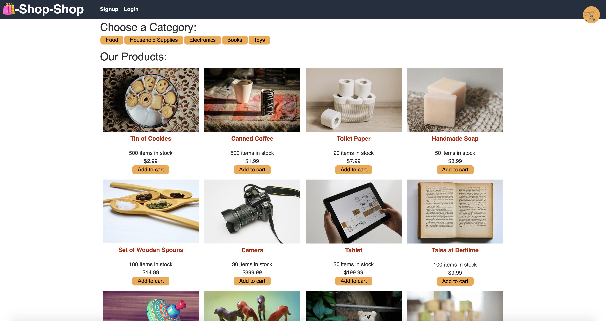
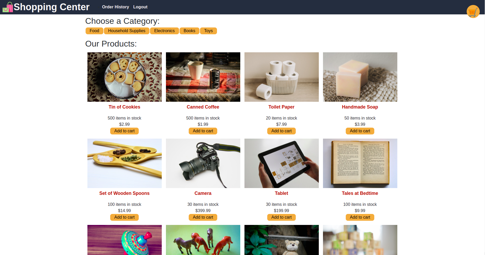
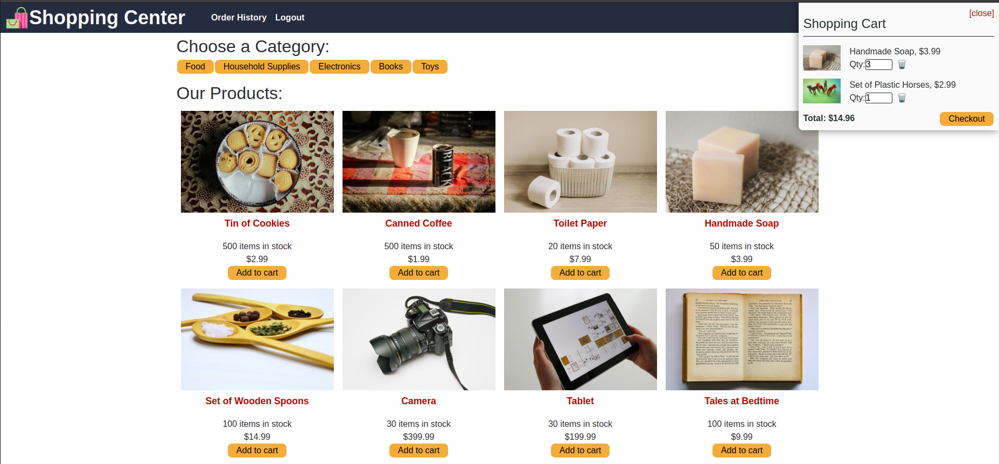
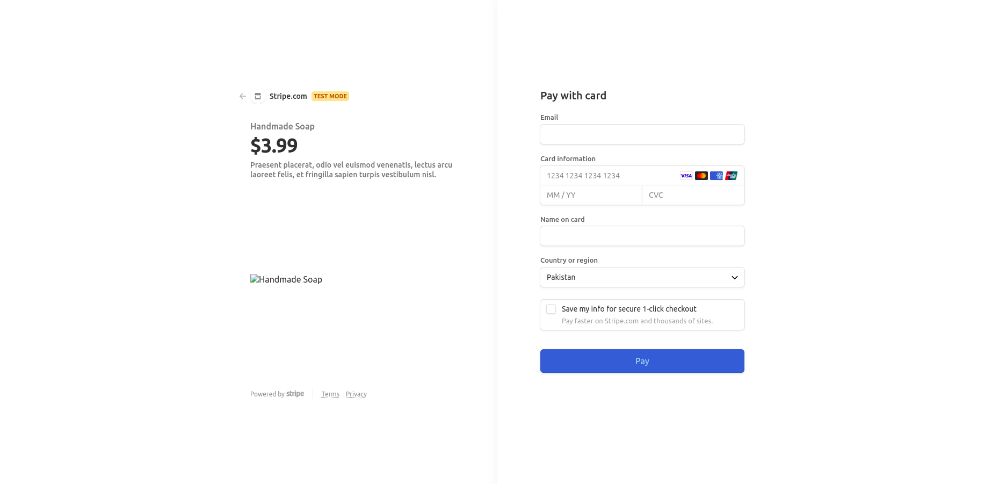
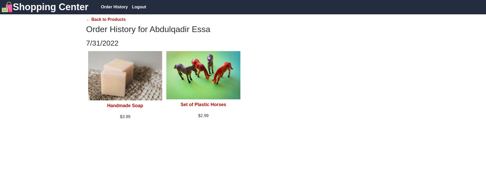

# Redux ShoppingCenter

## Description

AS a senior engineer working on an e-commerce platform. I want my platform to use Redux to manage global state instead of the Context API, so that my website's state management is taken out of the React ecosystem.
GIVEN an e-commerce platform that uses Redux to manage global state when I review the app’s store. 

It has following features:

- It uses a Redux store instead of the Context API
- It can review the way the React front end accesses the store
- The app uses a Redux provider
- The app determines changes to its global state
- The app passes reducers to a Redux store instead of using the Context API
- The app extracts state data from the store
- The app uses Redux instead of the Context API
- The app dispatches actions
- The app uses Redux instead of the Context API

## Table of Contents
* [Installation](#installation)
* [Usage](#usage)
* [License](#license)
* [Contributing](#contributing)
* [Tests](#tests)
* [Questions](#questions)

## Installation 
The user should clone the repository from GitHub and install dependencies. For development or testing purposes, run `npm install` on both client and server directories to install dependencies. There are two servers for client side and server side, which can be run on their own. To run both servers at the same time, open the root directory and run `npm start`.

## Usage 
This application will allow users to add products to their cart either from the main page or product page. Users can then checkout using Stripe and view their order history. 
Please view deployed application on [Heroku]https://nw-reduxshop.herokuapp.com//) 

## License 
This project is license under MIT

## Contributing 
Contributors should read the installation section. 

## Tests
This application tests the reducers. 

## screenshots

## Deployed application link
https://sh0ppingcenter.herokuapp.com/

## Github repo link
https://github.com/AbdulQadir51/shoppingcenter

## Questions
If you have any questions about this projects, please contact me directly at abdulessa93@gmail.com. You can view more of my projects at https://github.com/AbdulQadir51.
